# IoTreta
Dirty IoT tricks!
[**Cleuton Sampaio**](https://github.com/cleuton)

# Caraca! Direto para a Amazon: AWS IoT!

Fala muuuiiito sério! Isso é que é **IoT**! Estou usando o serviço [**AWS IoT**](https://aws.amazon.com/pt/iot/?sc_channel=PS&sc_campaign=acquisition_BR&sc_publisher=google&sc_medium=english_iot_b&sc_content=iot_e&sc_detail=aws%20iot&sc_category=iot&sc_segment=154427534320&sc_matchtype=e&sc_country=BR&s_kwcid=AL!4422!3!154427534320!e!!g!!aws%20iot&ef_id=WcgvrQAABfqRGRdV:20180418210049:s) para conectar meu dispositivo Arduíno, que mede a temperatura e envia para o [**MQTT Broker**](http://mqtt.org) dele!


## MQTT

É um protocolo que utiliza a metáfora **Publisher/Subscriber** para troca de mensagens entre dispositivos automatos (Arduínos e outros micro controladores). O Serviço **AWS IoT** oferece não só o serviço *Broker* de mensagens, como também vários outros agregados. 

É possível criar funções **AWS Lambda** para processar as mensagens, armazenando-as em um Banco de dados **DynamoDB** ou então gerando ações.

## Um exemplo simples

Para simplificar as coisas, vamos começar com um exemplo bem simples: O Medidor de temperatura enviando mensagens para o AWS IoT. Esqueceu qual é? É aquele que [**mostrei no tutorial passado**](.iotwitando)!!!!!


Calma! O processo é meio burocrático, mas é simples e eu vou te guiar passo a passo.

### Crie uma conta

Crie uma conta na Amazon e se cadastre para o [**AWS IoT**](https://aws.amazon.com/pt/iot/).
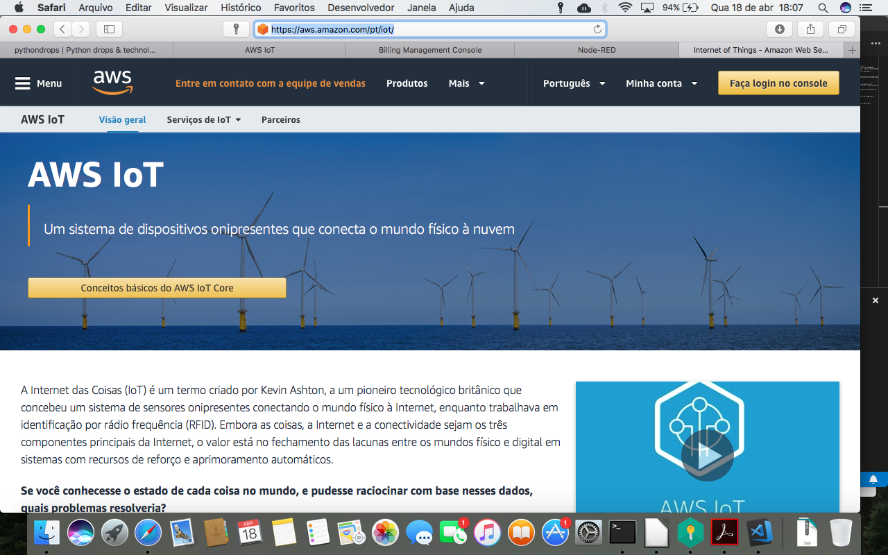

Você deverá se logar ma [**Console IoT**](https://console.aws.amazon.com/console/home) para começar a trabalhar.
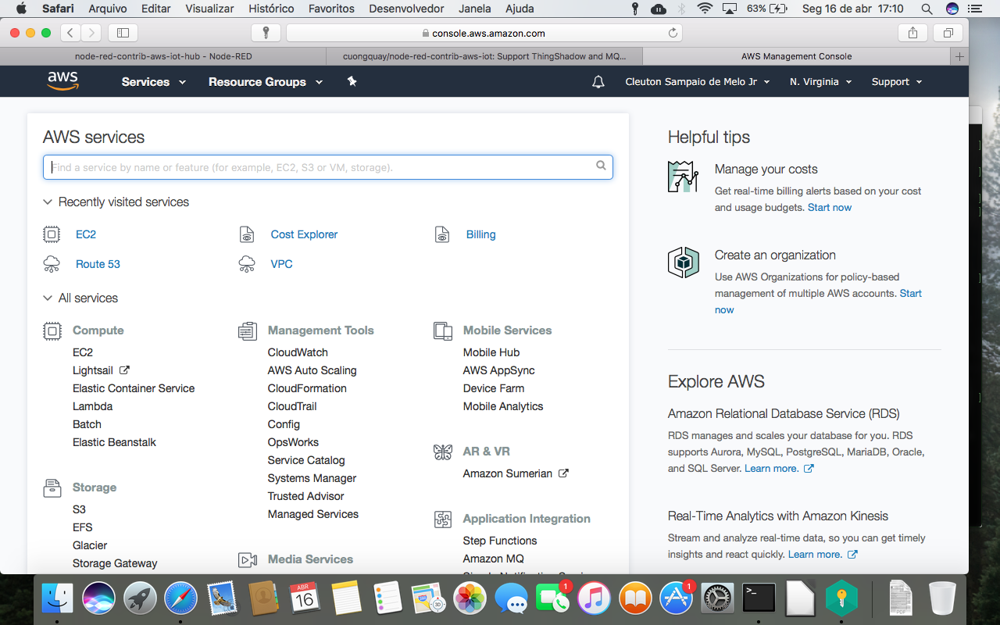
É só procurar o serviço **IoT**.

### Crie uma "coisa"

A Amazon chama os dispositivos de "Things" (coisas). 

Abra "manage / things" e selecione "Register a Thing", depois "Create a single IoT thing".
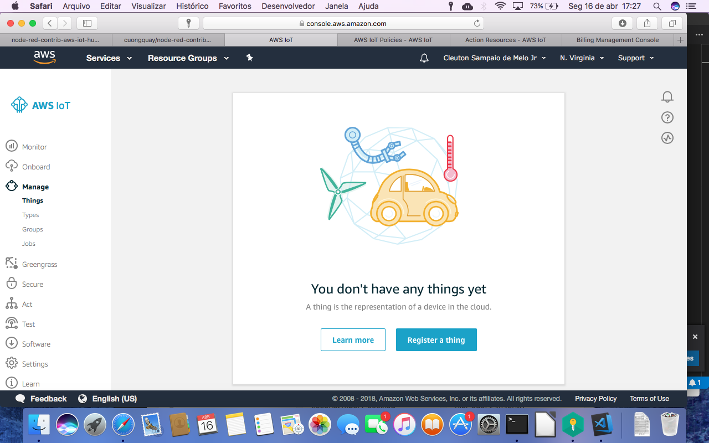

Dê um nome à sua "thing" e clique next.
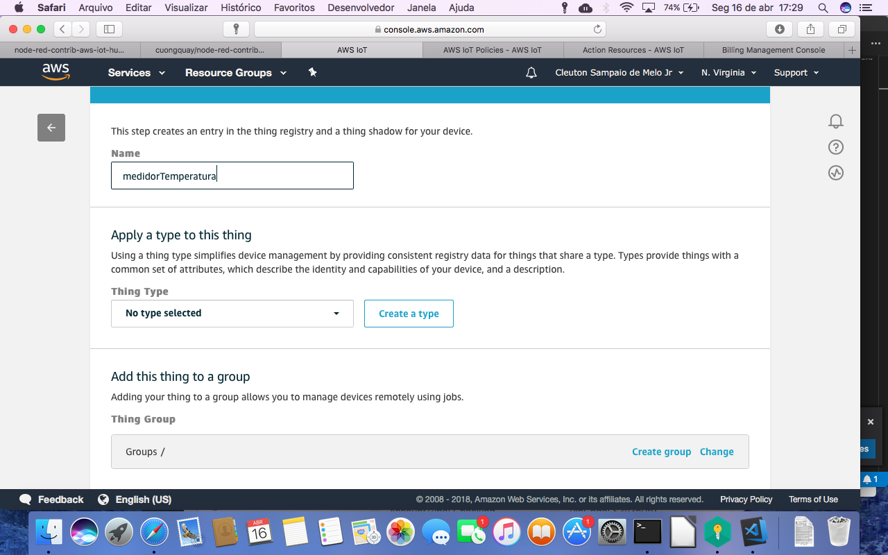

É preciso criar um certificado. Clique em "Create certificate" (one-click certificate creation).
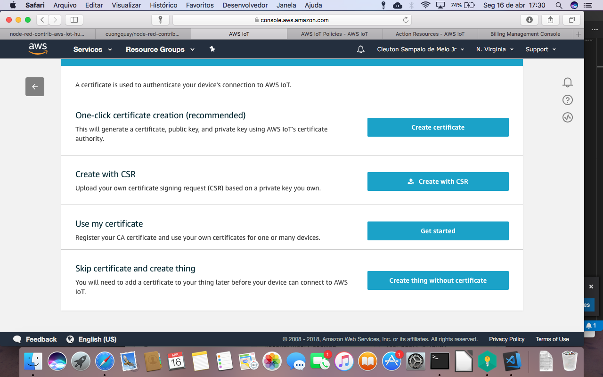

Baixe os 3 arquivos, clicando nos links de download e, por último, baixe o certificado da CA, salvando como root-ca.crt e clique no botão "Activate" para ativar o certificado, e depois clique em DONE.

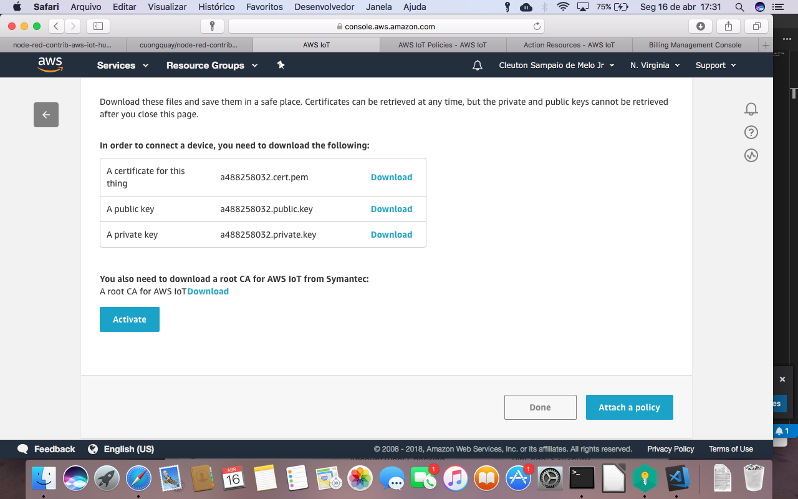

Precisamos criar uma "Policy" para que nossa "Coisa" (Thing) possa publicar mensagens em um tópico do MQTT. Um tópico é um "assunto". Para isto, é preciso obter o account id: Dentro da console, abra uma aba e [vá para sua conta:](https://console.aws.amazon.com/billing/home?#/account).
Anote o ID da sua conta e 
volte à console do serviço IoT, selecione o menu "Secure / Policies" e clique em Create.

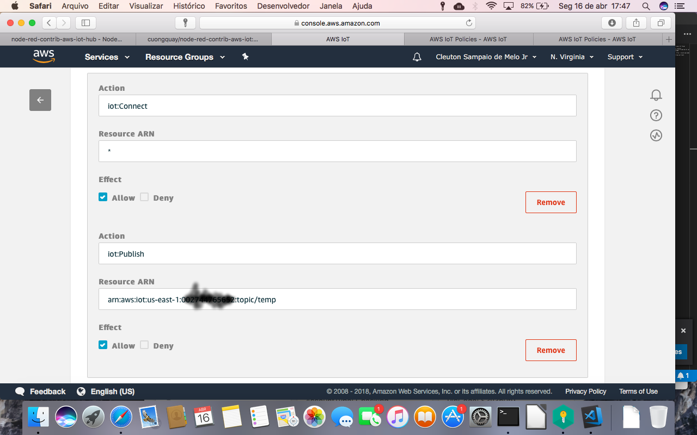

Você precisa cadastrar cada **Action** possível, cicando em "Add Statement" para adicionar cada uma delas. Quais ações precisamos criar? 
```
{
  "Version": "2012-10-17",
  "Statement": [
    {
      "Effect": "Allow",
      "Action": "iot:Connect",
      "Resource": "*"
    },
    {
      "Effect": "Allow",
      "Action": "iot:Publish",
      "Resource": "arn:aws:iot:us-east-1:xxxxxxx:topic/temp"
    },
    {
      "Effect": "Allow",
      "Action": "iot:Subscribe",
      "Resource": "arn:aws:iot:us-east-1:xxxxxxx:topic/temp"
    }
  ]
}
```
Precisamos de uma **Action** para permitir a conexão (iot:Connect), outra para publicar mensagens no tópico "temp" (iot:Publish) e finalmente uma para subscrever e obter mensagens do tópico "temp" (iot:Subscribe). É só incluir a primeira **Action**, clicar em "Add Statement" e incluir as outras.

O identificador de recurso (resource arn) é composto por: 
```
arn?aws?iot?us-east-1:[seu account ID]:
```
Para cada recurso temos uma abreviação, no caso de "tópico" é "topic". No exemplo, estou dando permissões para o recurso "temp", que é um tópico.

### Instalando os nodes AWS

O node-red é uma plataforma estensível, e existe um módulo muito legal que possui Nodes para falar com o AWS: [**node-red-contrib-aws-iot-hub**](https://flows.nodered.org/node/node-red-contrib-aws-iot-hub). Vamos instalá-lo na pasta do **NodeRed**: ~/.node-red: 
```
npm install node-red-contrib-aws-iot-hub
```
Agora, temos Nodes para ler do AWS IoT e publicar no AWS IoT.

### Modificando o fluxo

O novo fluxo está no arquivo [**arduino_aws.node**](./arduino_aws.node). Eu obfusquei o endpoint, mas você pode obter o seu entrando no menu "Settings" da AWS IoT Console.

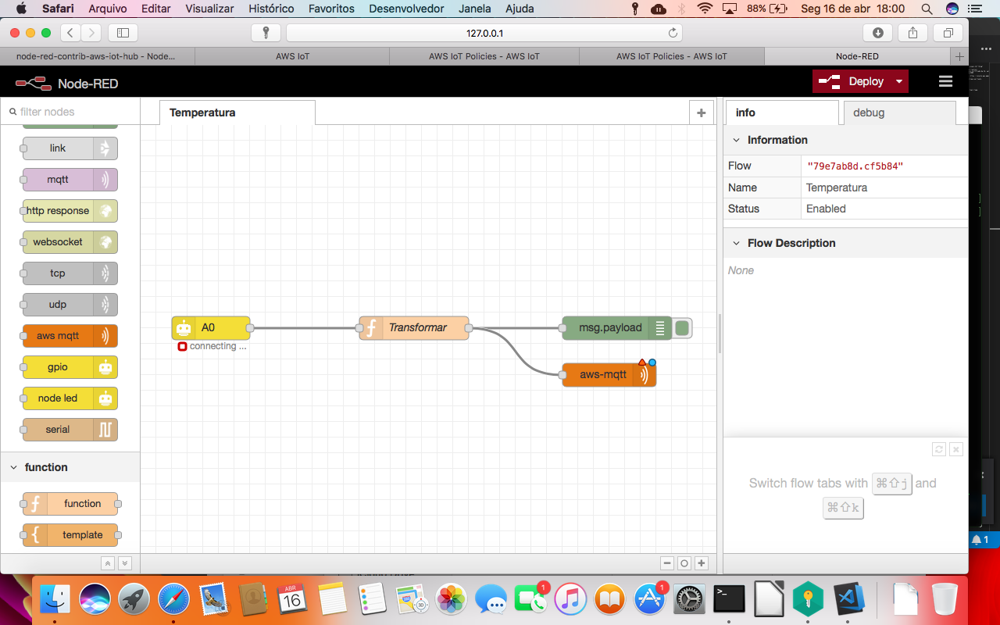

Para configurar o Node AWS IoT, você precisa adicionar um novo dispositivo AWS IoT, clicando no botão do lápis.

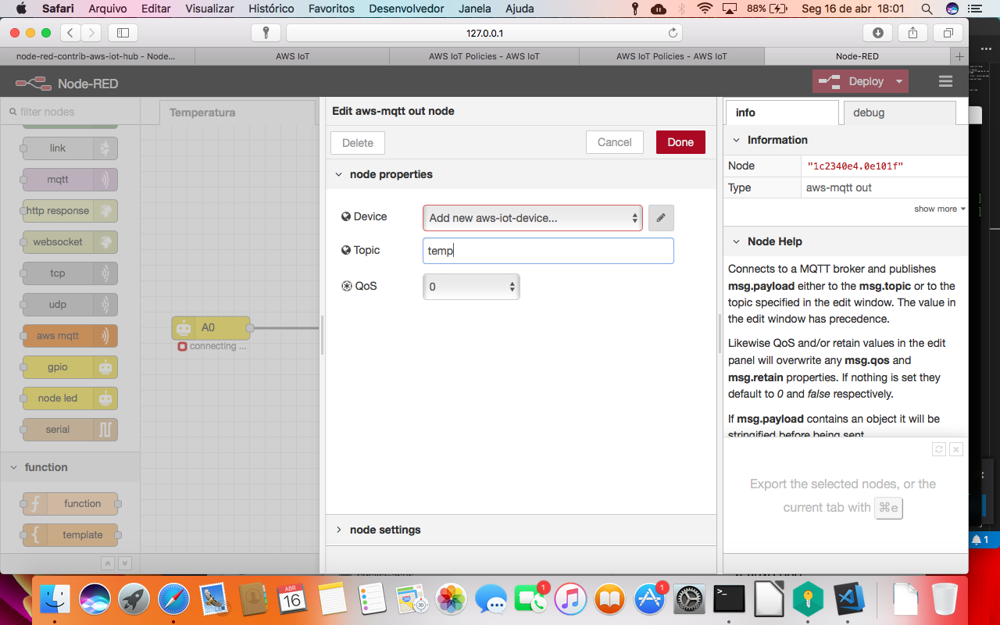

Quando você baixou os arquivos do certificado, deve ter pelo menos 3 deles: 
- medidorTemperatura.cert.pem
- medidorTemperatura.private.key
- root-CA.crt

Esse nome de arquivo tem que ser muito bem pensado... O primeiro nome "medidorTemperatura" será o seu "client ID", que você informará ao configurar o node AWS IoT. O nome dos arquivos tem que ser exatamente assim: 
- [client ID].cert.pem
- [client ID].private.key
- root-CA.crt

E você tem que guardar o caminho da pasta onde os gravou!

Agora, vamos configurar o Dispositivo AWS IoT: 

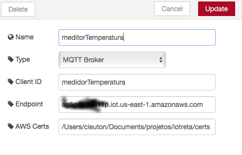

O campo **EndPoint** você obtém do AWS IoT console. O campo **AWS Certs** é o caminho do diretório onde você gravou os certificados. 

## Testando

Agora, é só fazer **Deploy** do fluxo e rodar, lembrando-se de conectar seu Arduino!

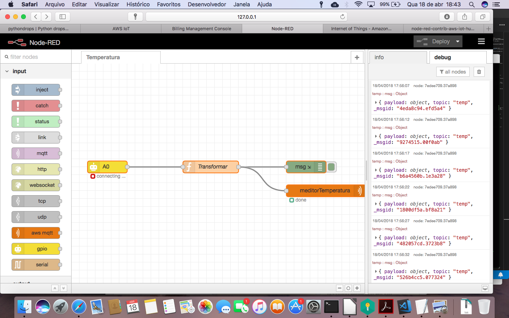

O meu node **Function** está formadando a mensagem a ser enviada assim: 
```
T0 = 25 + 273.15;  
RT0 = 1000;
B = 3977;
VCC = 5;
R = 1000;
VRT = msg.payload;
VRT = (5.00 / 1023.00) * VRT;      
VR = VCC - VRT;
RT = VRT / (VR / R);               

ln = Math.log(RT / RT0);
TX = (1 / ((ln / B) + (1 / T0))); 

TX = TX - 273.15;
d = new Date();
msg.topic = "temp"
msg.payload = {"temperatura":TX}
return msg;
``` 
É muito importante criar o campo "msg.topic" na mensagem, com o mesmo nome do tópico para o qual você autorizou seu Arduíno a publicar (lembra-se da "Policy"?).

## Mas chegou na Amazon?

Ah, grande pergunta! Podemos usar o cliente MQTT de teste, da console AWS, para subscrevermos no tópico "temp" e vermos o que está sendo enviado para ele. Abra o menu "Test". Isto iniciará um cliente Web MQTT. Escolha "Subscribe to topic" e digite "temp".

