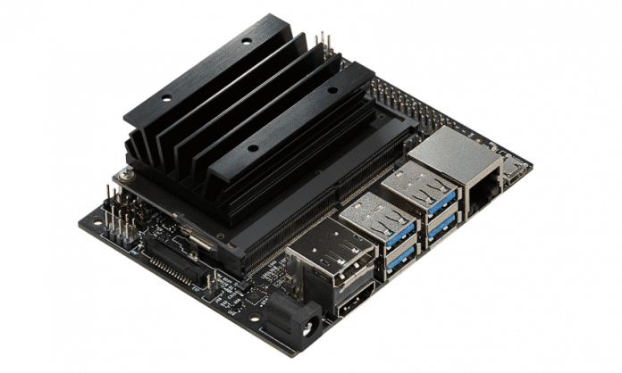

# IoTreta
Dirty IoT tricks!
[**Cleuton Sampaio**](https://github.com/cleuton)

## Nvidia Jetson Nano

Criamos uma nova seção no **Iotreta** dedicada a esta placa fantástica da Nvídia:

## Um truque "sujo"

Que tal puxar o saco do chefe e conseguir aquela promoção? Que tal posar de "especialista" em IoT, sem saber P.N. de eletrônica? 

Aqui, no **IoTreta** eu te ensinarei desde "coisinhas" legais, para fazer nas festinhas da Empresa, até aplicações IoT complexas coletando dados atmosféricos e enviando para a **Amazon**.

## NodeRed

Para começar, vou mostrar o [**NodeRed**](https://nodered.org), um software, feito em **NodeJS**, que permite a um computador controlar um dispositivo IoT, como: Arduíno ou Raspberry. E, na verdade, você pode ter um Raspberry controlando um ou vários Arduinos!

## Python!

Agora, teremos uma série de tutoriais usando **Python!** Isso mesmo! Aguarde!

# 1 - Primeiro tutorial

Nesse primeiro tutorial, você vai precisar comprar um Arduíno! É simples! Compre no Mercado Livre, que custa baratinho! Mas veja se ele vem com o Cabo USB, para ligar no seu computador. Você não precisará de mais nada!

Instale o [**NodeJS**](https://nodejs.org/en/) no seu Computador! Depois, siga as [**instruções**](https://nodered.org/docs/getting-started/) para instalar o NodeRed.

Antes de conectar seu Arduíno, leia as [**instruções de configuração**](https://nodered.org/docs/hardware/arduino). No vídeo, eu mostro como fazer.

O primeiro exemplo está no arquivo "treta1_blink.node". Abra o arquivo, selecione tudo, copie e cole no NodeRed. No vídeo eu explico como fazer.

# 2 - Tuitando a temperatura direto do Arduíno

Fala sério, cara! Veja esse [**novo tutorial**](./iotwitando)

# 3 - Direto para a AMAZON AWS IoT

Caraca! Mandando a temperatura direto para o serviço MQTT da Amazon: **AWS IoT**! Isso é que é IoT de verdade!
Veja só: [**Direto Para a Amazon**](./DiretoParaAmazon)

# 4 - O caminho de volta

Veja como fazer um dispositivo **IoT** acessar um Broker, como o **AWS IoT** e obter mensagens: [**do AWS para o Arduino**](./amazon_arduino).

