# IoTreta
Dirty IoT tricks!
[**Cleuton Sampaio**](https://github.com/cleuton)

# Tuitando a temperatura do meu Arduíno!

Fala sério! Criei um termômetro com o Arduino e, além de mostrar a temperatura, ele ainda Tuita para o mundo! Caraca! É o princípio de uma estação meteorológica automática, não? Se eu colocar o **NodeRed** para rodar no Raspberry, posso usar minha **placa solar** e deixar essa *bagaça* rodando infinitamente.

# comofaz?

Você "manja" de eletrônica? Não? ÓTIMO! NEM EU! kkkkkk

## Arduino e circuito

Calma, muita calma. Já comprou seu [**Arduino**](https://produto.mercadolivre.com.br/MLB-814041334-arduino-uno-r3-atmega328-dip-com-cabo-usb-_JM) compre um **Arduino UNO ORIGINAL**! Tem uns Chineses que, embora funcionem bem, exigem um driver diferente e isto pode te frustrar um pouco. 

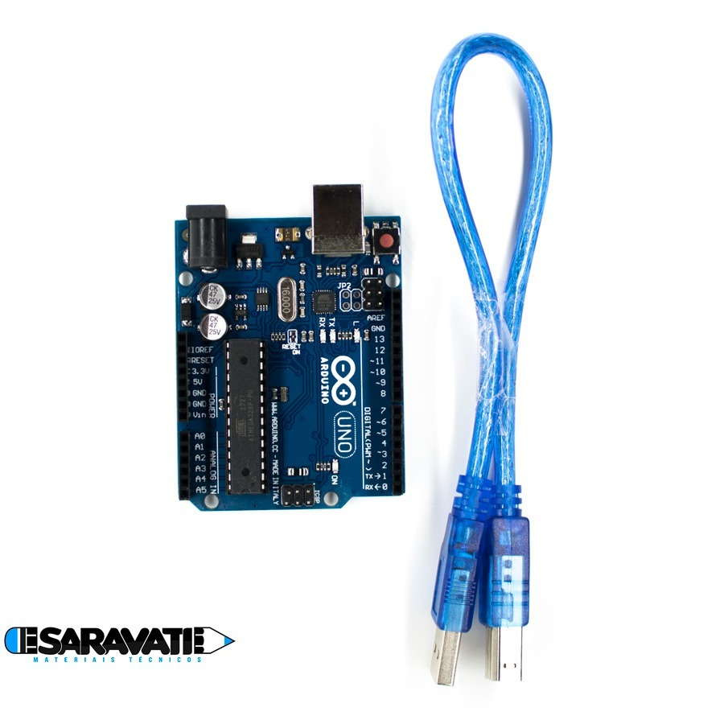

## Materiais

Você vai precisar montar um **Termistor NTC de 1000 Ohms** em um circuito, e liga-lo ao Arduino. É esse resistor especial, o **Termistor**, que permite medirmos a temperatura ambiente. Você vai precisar de alguns materiais. Tome nota: 

### Protoboard

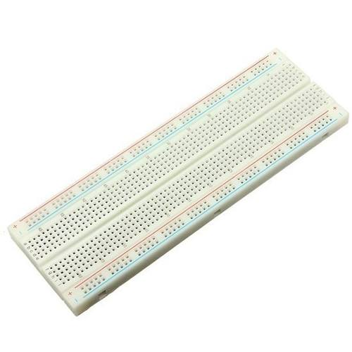

Ela tem alguns conjuntos de furos conectados. Nas grandes laterais, há dois trilhos de furos conectados, geralmente para ligar a voltagem (+5v) e o terra. As duas linhas de furos horizontais dos grandes lados, são conectadas na horizontal!

No meio, há um sulco de um lado a outro. Acima e abaixo deste sulco ficam colunas de furos interligados. Cada coluna tem uns 5 furos conectados verticalmente! Atenção, isto é importante!

Não há ligação entre furos de colunas diferentes.

Nela, montaremos o circuito do Termistor. Você encontra no [**Mercado livre**](https://produto.mercadolivre.com.br/MLB-717227378-protoboard-830-pontos-furos-breadboard-matriz-de-contato-_JM).

### Termistor 102 (1K Ohm)

Segundo a wikipedia: 
Termístor (ou termistor) são semicondutores sensíveis à temperatura.

Existem basicamente dois tipos de termístores:

- **NTC** (do inglês Negative Temperature Coefficient) - termístores cujo coeficiente de variação de resistência com a temperatura é negativo: a resistência diminui com o aumento da temperatura.
- **PTC** (do inglês Positive Temperature Coefficient) - termístores cujo coeficiente de variação de resistência com a temperatura é positivo: a resistência aumenta com o aumento da temperatura.
Conforme a curva característica do termístor, o seu valor de resistência pode diminuir ou aumentar em maior ou menor grau em uma determinada faixa de temperatura.

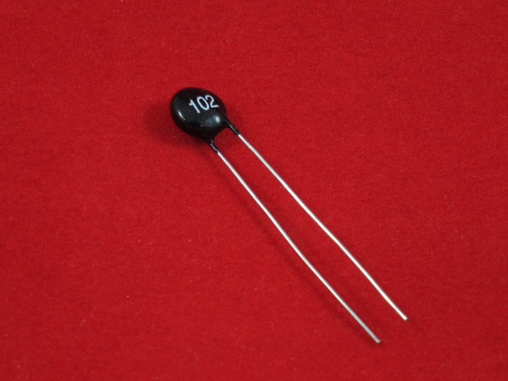

Compre um termistor NTC de 1k Ohm (102). Tem no [**Mercado livre**](https://produto.mercadolivre.com.br/MLB-775161502-termistor-ntc-1k-3mm-com-10-pcs-_JM)

### Resistor de 1K Ohm

Nós montaremos um circuito [**divisor de tensão**](http://www.feiradeciencias.com.br/sala12/12_t03.asp) ligando o resistor e o termistor em série. Logo precisamos de um resistor com a mesma capacidade do termistor (1K Ohm). Esse resistor tem as cores: vermelho, preto e marrom.

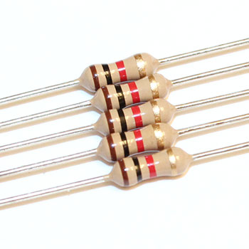

Você encontra pacotes de resistores de várias capacidades fácilmente. Veja no [**Mercado livre**](https://lista.mercadolivre.com.br/resistor-1k)

### cabos com jumpers

Para conectar tudo na protoboard, precisamos de cabos jumpers do tipo macho-macho: 
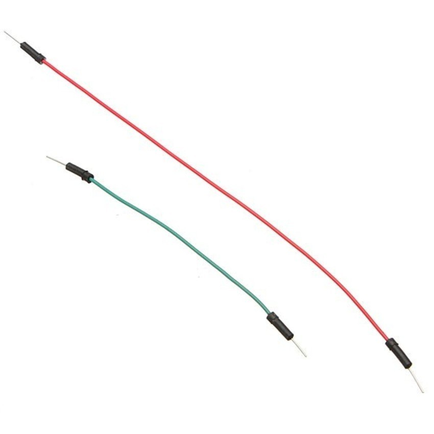

Podem ser encontrados em pacotes com várias cores no [**Mercado livre**](https://produto.mercadolivre.com.br/MLB-721304800-kit-jumpers-macho-macho-x65-unidades-fio-cabo-protoboard-_JM)

## Montagem do circuito

Vamos montar um circuito assim (essa figura é dos [**tutoriais do arduino**](https://create.arduino.cc/projecthub/Marcazzan_M/how-easy-is-it-to-use-a-thermistor-e39321?ref=search&ref_id=thermistor&offset=0)): 


Se preferir, eis o diagrama do circuito que vamos montar ([fonte](https://www.electronics-tutorials.ws/io/thermistors.html)):

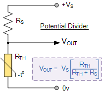

A montagem é bem fácil. Resistores e termistores não possuem polarização, logo, pode ligá-los de qualquer lado. O importante é verificar os cabos que vão do +5v para o Terra (GND). Lembre-se como os furos da Protoboard estão conectados! Se seguir o esquema da foto, vai ficar certinho.

## IDE do Arduino

Para funcionar, é necessário baixar a [**IDE do Arduino**](https://www.arduino.cc/en/main/software).

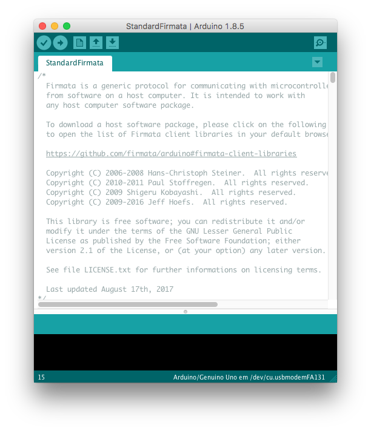

Não vou programar o Arduíno usando a IDE, mas, para funcionar, precisamos de uma implementação do protocolo [**Firmata**](https://www.arduino.cc/en/Reference/Firmata).

Vamos ter que carregar o programa "StandardFirmata" na EPROM do Arduino, para que ele possa se comunicar com o NodeRed.

## Conecte seu Arduino e carregue StandardFirmata

Conecte o cabo serial no Arduino e em uma das entradas USB do seu computador. Abra a IDE do Arduíno. É muito importante saber em qual PORTA de comunicação ele está. Abra o menu **Ferramentas / Porta** e anote a porta onde o Arduino está. Isso varia de sistema operacional para outro. Anote esse nome!

Depois, abra o exemplo **StandardFirmata**, usando o menu **Arquivo / Exemplos / Firmata / StandardFirmata**.

Com o exemplo carregado, compile-o (menu **Sketch / Compilar**) e carregue-o na EPROM do Arduino (menu **Sketch / Carregar**).

Agora, **ENCERRE A IDE DO ARDUINO** pois vamos usar o NodeRed.

## Preparação do NodeRed

Precisamos instalar uma biblioteca no seu NodeRed, para usar scripts do Johnny five. Abra um terminal e abra a pasta do NodeRed, normalmente: **~/.node-red**. Depois, digite: 
```
npm install node-red-contrib-gpio
```
Agora, você terá mais alguns Nodes para usar no NodeRed!

## Criar o fluxo

O fluxo que eu criei é bem simples, conforme a figura: 

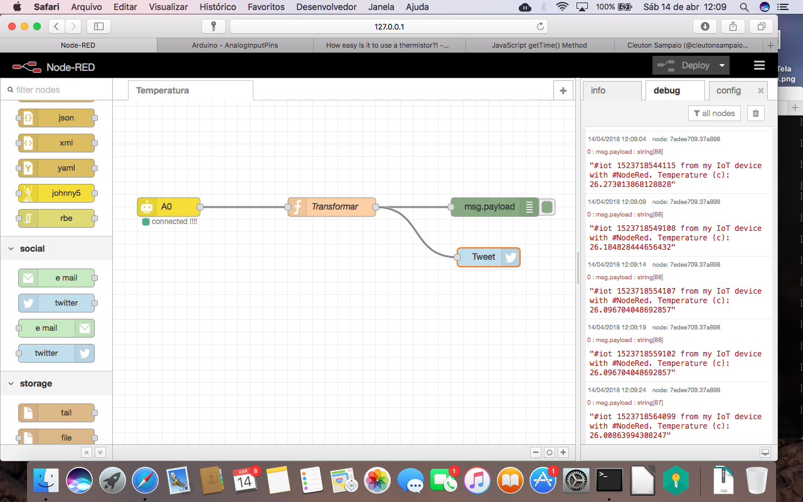

Um node de **Input** do Johnny five, que lerá o pino A0 do Arduíno, um nó **Function**, que transformará o resultado, e um nó **Debug**, que mostrará o resultado. Também incluí um nó **Twitter** para tuitar a temperatura!

Ao adicionar o nó **Input** precisamos informar qual é a placa, para isto, criamos um novo NodeBot (clicando no "lápis") e temos que informar a **PORTA** onde ela está conectada (lembra, copie da IDE do Arduíno).

Eu cofigurei o nó **Input** para coletar a cada 5 segundos: 

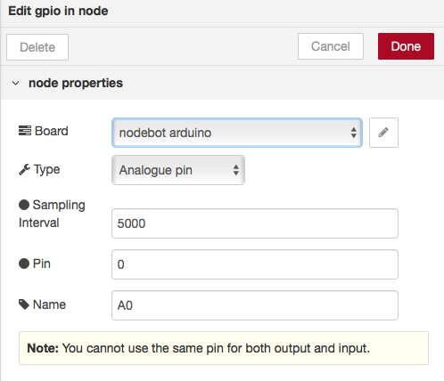

O Node **Function** precisará pegar a saída do **Input**, que é a voltagem do circuito, e transformar em temperatura. Arraste um node **Function** para o fluxo, dê duplo-clique e configure assim: 

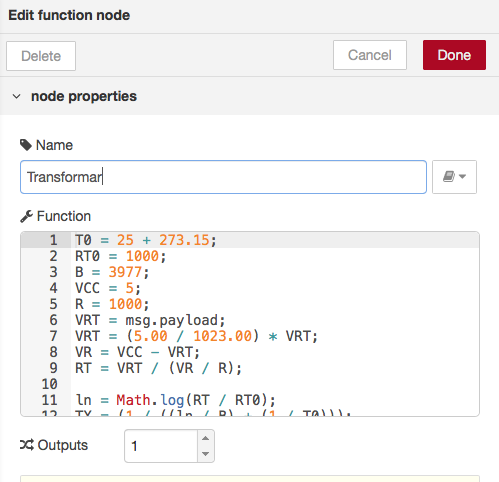

Eis o código-fonte da função, em Javascript: 
```
T0 = 25 + 273.15;  
RT0 = 1000;
B = 3977;
VCC = 5;
R = 1000;
VRT = msg.payload;
VRT = (5.00 / 1023.00) * VRT;      
VR = VCC - VRT;
RT = VRT / (VR / R);               

ln = Math.log(RT / RT0);
TX = (1 / ((ln / B) + (1 / T0))); 

TX = TX - 273.15;
d = new Date();
msg.payload = "#iot " + d.getTime() + " from my IoT device with #NodeRed. Temperature (c): " +  TX;
return msg;
```
Eu peguei este código do [**Project hub**](https://create.arduino.cc/projecthub/Marcazzan_M/how-easy-is-it-to-use-a-thermistor-e39321?ref=search&ref_id=thermistor&offset=0) do Arduino e converti para Javascript.

O node **Debug** é só arrastar, já o node **Twitter** vai necessitar que você configure com a sua conta no Twitter: 

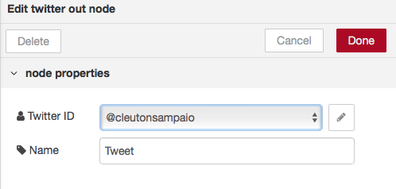

## Carregando do arquivo

Se estiver com preguiça, use o arquivo [**temptweet.node**](./temptweet.node) que eu já deixei aqui prontinho. Só terá que configurar a **PORTA** e a conta do **Twitter**. Para importar todo o fluxo, clique no botão no canto superior direito da página (três traços horizontais) e selecione o menu **Import / clipboard**, colando o conteúdo do arquivo na caixa de diálogo.

## Faça deploy e veja o resultado!

Depois de fazer deploy, seu Arduíno tuitará a temperatura: 

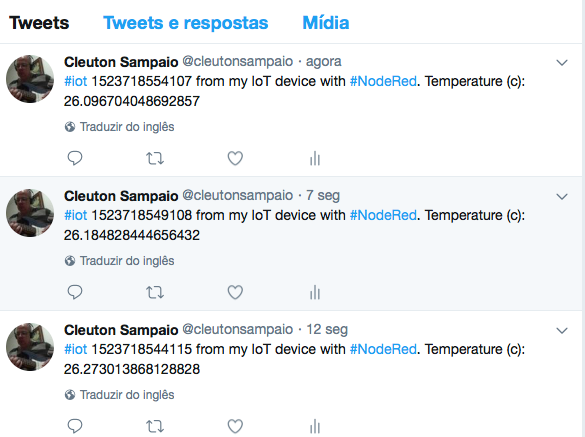

E olha a *bagaça* ae...

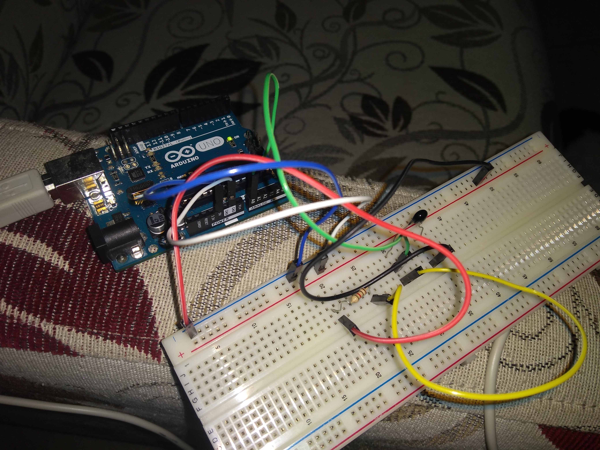