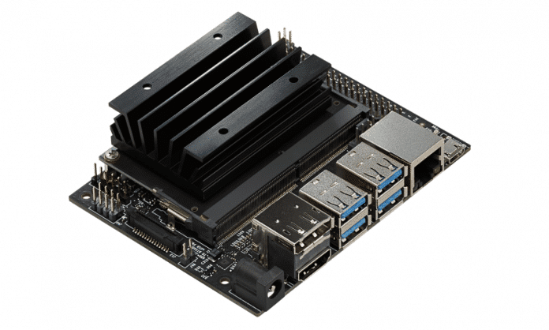

# IoTreta
Dirty IoT tricks!
[**Cleuton Sampaio**](https://github.com/cleuton)

# Nvidia Jetson Nano
## Primeiros passos

O [**Nvidia Jetson Nano**](https://developer.nvidia.com/embedded/jetson-nano-developer-kit) é um kit de desenvolviento para aplicações *IoT* que utilizem *Inteligência Artificial*. 

É um processador **quad-core** ARM com GPU **Nvidia Maxwell** embarcada. Eis as características: 

**CPU**

64-bit Quad-core ARM A57 @ 1.43GHz

**GPU**

128-core NVIDIA Maxwell @ 921MHz

**Memória**

4GB 64-bit LPDDR4 @ 1600MHz | 25.6 GB/s

Ele não vem com WiFi nem Bluetooth, e isso é muito importante!

## Setup

Antes de mais nada, você vai necessitar dessas coisas para instalar e dar boot em seu **Jetson Nano** pela primeira vez: 

- Um cartão micro SD de pelo menos 32 GB;
- Uma fonte de 5V com 2A de saída e conector micro-usb;
- Um teclado com conector USB;
- Um monitor (ou TV) com cabo HDMI;
- Um mouse USB.

Formate o cartão micro SD e instale o [**ubuntu da nvidia**](https://developer.nvidia.com/embedded/dlc/jetson-nano-dev-kit-sd-card-image) nele. Você pode formatar o cartão micro SD com o programa [**Etcher**](https://www.balena.io/etcher/) seguindo [**estas instruções**](https://developer.nvidia.com/embedded/learn/get-started-jetson-nano-devkit#write).

Insira o cartão micro SD na parte de trás da placa, até fazer um "clique": 

Posicione o Jetson Nano sobre o suporte que vem na própria caixa e Conecte tudo e deixe a fonte micro USB para o final.

Pronto! Agora, você verá a tela da Nvidia e poderá configurar o **Ubuntu** nele: 

Depois de configurar o **Ubuntu** está tudo pronto para você, embora ainda tenha que instalar algumas bibliotecas para funcionar tudo bem. 

## WiFi

Nem tente! Para começar, a fonte de 5V e 2A que você vai utilizar, não fornecerá intensidade suficiente para suportar muitos dispositivos, sendo melhor comprar uma fonte de 5V e 4A, com conector **barrel jacket**. 

Em segundo lugar, teoricamente, qualquer WiFi dongle USB funcionaria com o Jetson Nano, porém, nem todos possuem drivers para processadores ARM, portanto, você terá que baixar e compilar o driver, o que é muito chato e desagradável.

Para começar, eu sugiro a próxima alternativa...

## SSH

Seu **Jetson Nano** já vem com SSH Server e você pode utilizar um **SSH** client para programá-lo. É só anotar o endereço IP dele: 

E conectar de qualquer outro dispositivo que esteja no mesmo roteador, seja cabeado ou WiFi. Por exemplo, eu conectei do meu **iPad**: 

Se você chegou até aqui, parabéns! Conseguiu fazer seu **Jetson Nano** funcionar. Os próximos passos são: 

1. Instale o resto das bibliotecas (veremos no próximo post);
2. Compre uma fonte de 5V e 4A com conector barrel jack;
3. Se quiser processar imagens, compre uma [**câmera Raspberry PI**](https://www.jetsonhacks.com/2019/04/02/jetson-nano-raspberry-pi-camera/); 

