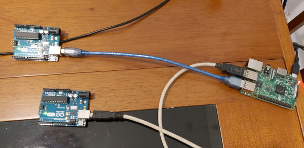
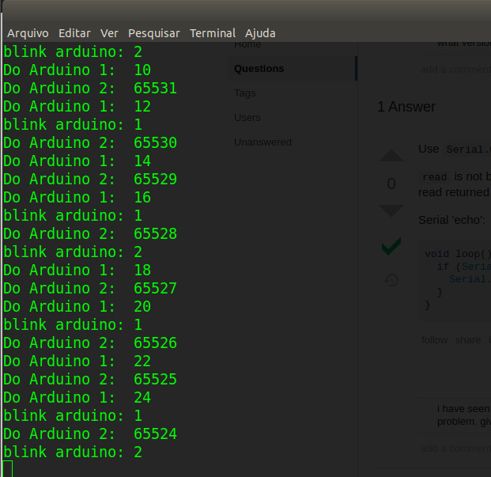

# IoTreta
Dirty IoT tricks!
[**Cleuton Sampaio**](https://github.com/cleuton)

[](https://www.lcm.com.br/site/#livros/busca?term=cleuton)

# Comunicação entre Raspberry PI e Arduino(s)

[**Raspberry PI**](https://pt.wikipedia.org/wiki/Raspberry_Pi) e [**Arduino**](https://pt.wikipedia.org/wiki/Arduino) são dois [**SoC** (System on a Chip)](https://pt.wikipedia.org/wiki/System-on-a-chip) muito populares entre os adeptos de [**Internet das Coisas** (IoT)](https://pt.wikipedia.org/wiki/Internet_das_coisas).

Mas são SoCs bem diferentes e com finalidades diferentes... Mas um arranjo muito comum é colocar 1 Raspberry controlado um ou mais Arduinos, e estes interfaceando os circuitos mais básicos. 

Por que? Bom, o Raspberry é um mini computador completo, multitarefa e com um sistema operacional baseado em Linux (Raspbian). Apesar dele possuir algumas portas GPIO, que podem ser utilizadas para interfacear circuitos e dispositivos, este não é o seu propósito e ele não é um controlador de "tempo real". Em outras palavras, o Raspberry está processando diversas tarefas simultaneamente e isso pode ser um problema quando tentamos controlar um dispositivo eletromecânico, como um robô, uma porta ou uma máquina industrial.

A própria configuração do Raspberry exige instalação de bibliotecas, além da dificuldade de configurar certos circuitos eletrônicos, que exigam entrada analógica. 

O Arduino é um microcontrolador, monoprogramável. Você baixa um programa nele e ele o executará para sempre. As interfaces são muito simples e de baixo nível, além de possuir conectores digitais e analógicos. Isso o torna o controlador ideal para os circuitos e dispositivos eletromecânicos. 

Por não possuir grande capacidade de processamento e armazenamento, o Arduino sozinho não deixa muita margem para aplicações mais sofisticadas. É aí que entra o Raspberry PI como controlador de Arduino(s).

Um Raspberry PI 3 é capaz de controlar e suprir energia para pelo menos dois Arduinos. Para mais do que isso, talvez seja melhor alimentar os Arduinos com baterias e usar um HUB USB.

## Prova de conceito



Esta é uma prova de conceito muito simples, com 1 Raspberry PI 3 e dois Arduinos. Cada Arduino envia sinais via interface serial para o RP3 (Raspberry PI 3), que recebe, analisa o sinal e, se for necessário, envia um comando para cada Arduino. 

Assim, temos comunicação bidirecional entre os Arduinos e o RP3, de forma completamente independente. 

O RP3 recebe de cada Arduino um valor inteiro (Um deles envia números negativos e o outro, positivos). Se um dos valores for divisível por 4, o RP3 envia de volta um byte e o Arduino que o receber, acenderá seu led onboard do pino 13. 

Isso simula, por exemplo, o caso de um medidor de temperaturas industriais. Se a temperatura de um determinado ambiente ou máquina passar de um limiar, o RP3 comanda o Arduino para que ligue um ventilador. 

O código do Arduino está [**AQUI**](./serial_test/serial_test.ino). Quando carregar em cada Arduino, sugiro modificar a contagem, por exemplo: 

- No primeiro (linha 11): a++;
- No segundo (linha 11): a--;

O código do Raspberry PI 3 está em Python 3. Para executá-lo, você vai precisar instalar: 
```
pip install RPi.GPIO
pip install pyserial
```

Você verá que, de tempos em tempos, o RP3 comanda o blink do led em cada Arduino. Veja uma tela do terminal: 

